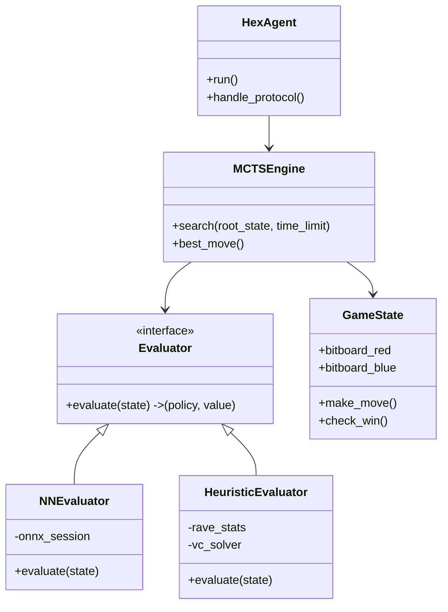

# Hex AI Technical Design: The "Dual-Mode" Engine

## 1. System Architecture Overview

The system is designed as a **Modular C++ Engine** with a **Pluggable Evaluation Layer**. This allows us to switch between "Neural Mode" (High Intelligence) and "Heuristic Mode" (High Speed) without changing the core search logic.

---

## 2. Component Breakdown

### A. The Infrastructure Layer
This layer handles communication with the tournament runner and manages the game loop.

#### 1. Python Wrapper (`MyAgent.py`)
*   **Role:** Process Manager & Protocol Translator.
*   **Key Functions:**
    *   `__init__`: Spawns the C++ subprocess (`./CppAgent`).
    *   `make_move(board)`:
        1.  Converts Python `Board` object to string `R00,0B0,...`.
        2.  Sends `CHANGE;...` or `START;...` to C++ via `stdin`.
        3.  Reads `x,y` from `stdout`.
        4.  Handles crashes (restarts C++ process if it dies).

#### 2. C++ Main Loop (`CppAgent.cpp`)
*   **Role:** Command Processor.
*   **Key Functions:**
    *   `parse_command(string)`: Splits `COMMAND;MOVE;BOARD;TURN` into tokens.
    *   `time_manager()`: Calculates how much time to spend on this move (e.g., "use 9.5s" or "panic mode").
    *   `main()`: Infinite loop waiting for `std::cin`.

---

## 3. The Core Engine Layer (C++)
This is the "Brain" of the bot.

#### 1. Board Representation (`Bitboard.h`)
*   **Data:** Two `__int128` (or `std::bitset<128>`) variables: `red_pieces`, `blue_pieces`.
*   **Key Functions:**
    *   `put(color, x, y)`: Sets a bit.
    *   `is_valid(x, y)`: Checks if bit is 0 in both boards.
    *   `check_win(color)`: Uses bitwise flood-fill to check for connection. **Critical for speed.**
    *   `get_neighbors(x, y)`: Returns a bitmask of neighbors.

#### 2. MCTS Engine (`MCTS.h`)
*   **Data:** Tree of `Node` objects.
*   **Key Functions:**
    *   `select(node)`: Uses UCT formula to descend the tree.
    *   `expand(node)`: Adds children to a leaf node.
    *   `backpropagate(path, result)`: Updates `wins` and `visits` up the tree.
    *   `run_search(root, timeout)`: The main loop. Runs 8 worker threads.

---

## 4. The Pluggable Evaluation Layer (The "Secret Sauce")
This interface allows us to swap brains.

`virtual EvaluationResult evaluate(const GameState& state);`

#### Mode A: Neural Evaluator (`NNEvaluator.cpp`)
*   **Used When:** We want maximum intelligence (AlphaZero style).
*   **Logic:**
    1.  Convert `Bitboard` to `float input[3][11][11]` (Red, Blue, Turn).
    2.  Run `Ort::Session::Run` (ONNX Runtime).
    3.  Return `policy` (vector of probs) and `value` (win prob).
*   **Optimization:** Uses **Int8 Quantization** and **Batching** (collects 32 requests before running).

#### Mode B: Heuristic Evaluator (`HeuristicEvaluator.cpp`)
*   **Used When:** NN is too slow (< 400 evals/s) or for "Panic Mode".
*   **The Problem:** Without a Brain, how do we know who is winning?
*   **The Solution:** We play the game to the end (Rollout), but we play **Smart**.

**1. The "Smart Rollout" Policy (The Simulation)**
Instead of playing completely random moves (which is weak), we use a lightweight policy during simulation:
*   **Rule 1 (Save Bridge):** If the opponent tries to cut a "Virtual Connection", we MUST respond to reconnect it.
*   **Rule 2 (Pattern 3x3):** If a local 3x3 pattern matches a known good shape (e.g., "The Bridge"), play it.
*   **Rule 3 (Random):** Only if no patterns match, play randomly.

**2. RAVE (The Statistical Intuition)**
*   **Concept:** We track "All-Moves-As-First" (AMAF).
*   **Logic:** If playing at `C5` resulted in a win in *any* simulation (even if it wasn't the first move), we increase the value of `C5` in the current root node.
*   **Result:** The agent quickly learns that "Center moves are good" and "Edge moves are bad" without needing a Neural Network to tell it.

**3. The Solver (H-Search)**
*   Before searching, we run a "Circuit Breaker" check.
*   If we find a chain of Virtual Connections that reaches from side to side, we return `Value = 1.0` (Win) immediately. This makes the agent **perfect** in the endgame.

---

## 5. Execution Phases (How it runs)

### Phase 1: Initialization
1.  Python script starts.
2.  Launches C++ binary.
3.  C++ binary loads `model.onnx`.
4.  C++ runs a "Warmup Inference" to check speed.
    *   If `speed > 800 evals/s`: Set `Mode = NEURAL`.
    *   Else: Set `Mode = HEURISTIC`.

### Phase 2: The Move Loop
1.  **Receive:** `CHANGE;5,5;...` (Opponent played 5,5).
2.  **Update:** Apply move to `Bitboard`.
3.  **Search:**
    *   Start 8 Threads.
    *   **Selection:** Threads descend tree using UCT.
    *   **Evaluation:**
        *   *Neural Mode:* Add state to Batcher. Wait. Batcher runs NN.
        *   *Heuristic Mode:* Run Rollout + H-Search.
    *   **Backprop:** Update stats.
4.  **Decide:** After 9.8 seconds, pick child with most `visits`.
5.  **Send:** Print `4,5` to stdout.

---

## 6. Modularity & Team Workflow

*   **Person 1 (Infra):** You own `HexAgent`, `CppAgent.cpp`, and `MyAgent.py`. You define the `Evaluator` interface.
*   **Person 2 (ML):** You own `NNEvaluator.cpp` and the Python Training Pipeline. You produce `model.onnx`.
*   **Person 3 (Engine):** You own `MCTSEngine` and `Bitboard`. You call `evaluator->evaluate()`.
*   **Person 4 (Smarts):** You own `HeuristicEvaluator.cpp`. You implement the RAVE and H-Search logic.

---

## 7. References & Provenance (Why we know this works)

This architecture is not a guess. It is based on the **University of Alberta's "MoHex"**, which won the Computer Olympiad Hex tournament every year from 2009 to 2019.

*   **The Core Logic:** Based on *"MoHex 2.0: A High Performance Two-Player MCTS Program for Hex"* (Huang et al., 2013).
*   **The Solver:** Based on *"An Introduction to the Hex-playing Program Deep Hex"* (Pawlewicz et al.), specifically the **H-Search** algorithm for virtual connections.
*   **The RAVE Logic:** Standard MCTS optimization for Go and Hex, proven to speed up convergence by ~10x in the early game.

**Verdict:** For a CPU-only environment, this is the scientifically proven "Best Known Method". Neural Networks only overtake this approach when you have massive GPU acceleration.
