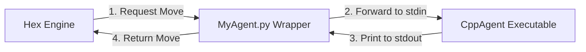
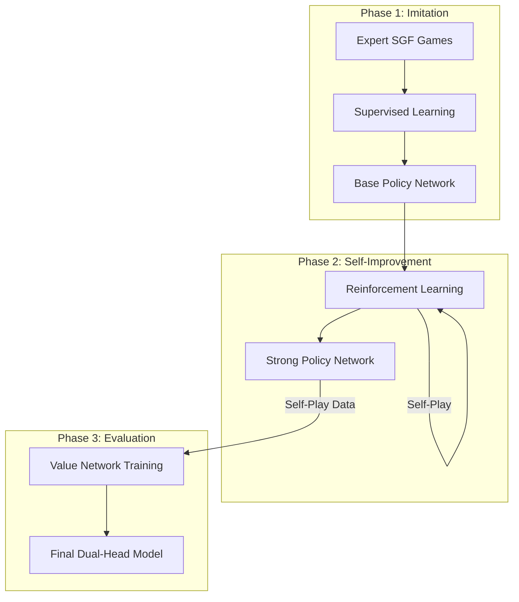
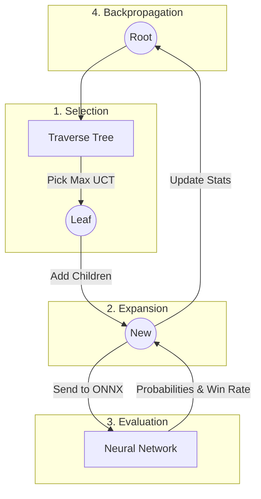

# Hex AI: Project Architecture & Guide

## 1. High-Level System Context

This diagram shows how the pieces of software talk to each other. The **Game Engine** runs the show, the **Python Wrapper** acts as a translator, and the **C++ Agent** does the heavy lifting.



---

## 2. Umbrella 1: The Neural Network (Training & Architecture)

The "Intuition" of our agent. It looks at a board and predicts two things:
1.  **Policy**: "Where should I play?" (Probability distribution over moves).
2.  **Value**: "Am I winning?" (Win probability, -1 to +1).

### Training Pipeline (The AlphaGo Approach)

We follow a 3-stage pipeline to train this network.



#### Phase 1: Supervised Learning (SL)
*   **Goal**: Teach the AI to mimic human experts.
*   **Data Source**: We will use archival Hex games (SGF format) from sources like **HexWorld** or the **Halifax Hex Club**.
*   **Process**: Feed board positions as input and the expert's move as the target. Minimize the difference between the network's predicted move and the expert's move.
*   **Result**: A decent player that plays "human-like" moves but makes tactical mistakes.

#### Phase 2: Reinforcement Learning (RL)
*   **Goal**: Teach the AI to win, not just mimic.
*   **Process**: The agent plays millions of games against itself.
    *   If it wins, the moves it made are "reinforced" (made more likely).
    *   If it loses, they are discouraged.
*   **Result**: A superhuman strategist that finds moves humans might miss.

#### Phase 3: Value Network
*   **Goal**: Teach the AI to judge a position instantly.
*   **Process**: Take the millions of positions generated during RL. Train a network to predict the *final game outcome* from that position.
*   **Result**: The agent can stop searching early and "guess" the winner, saving massive computation time.

---

## 3. Umbrella 2: Monte Carlo Tree Search (The Engine)

The "Reasoning" of our agent. It uses the Neural Network's intuition to guide a rigorous search of the future.

### The Intuition: UCT Formula
We don't search every move. We pick moves that maximize the **UCT Score**.

Formula:
`UCT = Q(s,a) + C * P(s,a) * [ sqrt(N(s)) / (1 + N(s,a)) ]`

Where:
*   **Q(s,a)**: The average win rate of this move so far (Exploitation).
*   **C**: A constant that controls how much we explore (usually around 1.0 to 1.41).
*   **P(s,a)**: The probability the Neural Network assigned to this move (Prior knowledge).
*   **N(s)**: How many times we have visited the parent position.
*   **N(s,a)**: How many times we have tried this specific move.

This formula ensures we try moves that the Neural Network likes (`P` is high) or that are winning (`Q` is high), but eventually we explore other moves as `N(s)` grows larger than `N(s,a)`.

### The 4 Phases of MCTS



1.  **Selection**: Start at the root. Move down the tree by picking the child with the best balance of Win Rate and Curiosity until you hit a leaf node (a state we haven't fully explored).
2.  **Expansion**: Add a new child node to the tree for the move we just chose.
3.  **Evaluation**:
    *   **Old Way**: Play random moves until the game ends (Rollout). Slow and noisy.
    *   **Our Way**: Ask the **Neural Network**. It instantly returns:
        *   **Probabilities**: Which moves are likely good.
        *   **Value**: Who is winning right now.
4.  **Backpropagation**: Take that Value and walk back up the tree, updating the average win rate and visit count for every node we passed.

---

## 4. System Integration (C++ + ONNX)

How do we combine the Python-trained Brain with the C++ Engine?

*   **Training**: Done in Python (PyTorch). Exported to `model.onnx`.
*   **Inference**: The C++ Agent loads `model.onnx` using **ONNX Runtime**.
*   **Performance**: This allows us to run thousands of MCTS simulations per second, as the Neural Network call is a direct C++ function call, not a slow Python script.

### Directory Structure

```text
agents/Group43/
├── CppAgent.cpp       # Main C++ source (MCTS + ONNX calls)
├── Makefile           # Build script (Links libonnxruntime)
├── MyAgent.py         # Python wrapper (Launches CppAgent)
├── cmd.txt            # Config file
├── lib/               # Libraries (libonnxruntime.so)
├── model.onnx         # Trained Neural Network
└── training/          # Training scripts
    ├── train.py       # PyTorch training loop
    └── export.py      # ONNX export script
```
