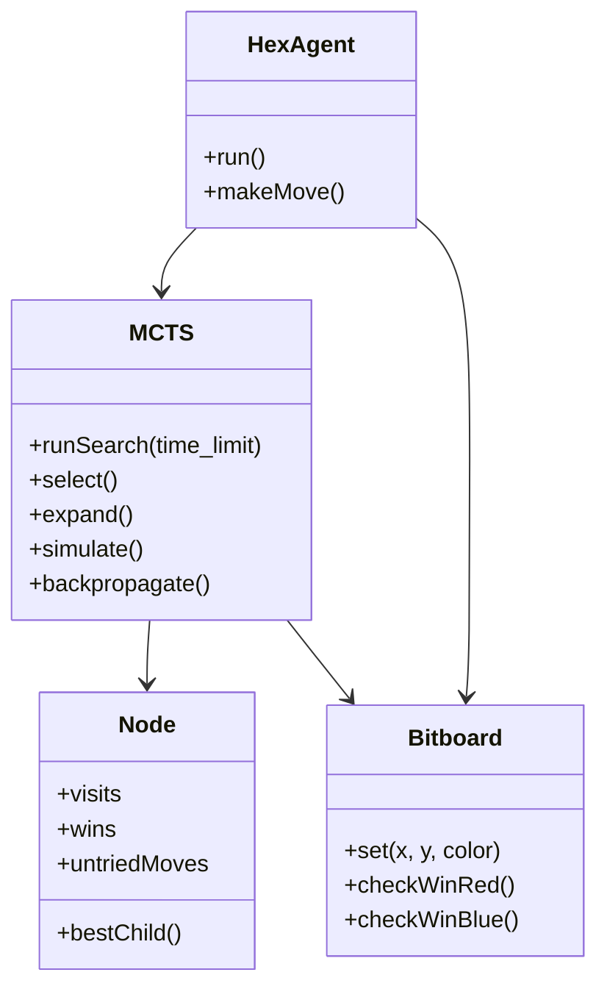

# Hex AI Technical Design

## 1. System Architecture Overview

The system is designed as a **High-Performance C++ MCTS Engine**.

Currently, we have implemented **Phase 1: The Core MCTS Engine**.
Future phases will introduce a **Pluggable Evaluation Layer** to support Neural Networks and Heuristics.



---

## 2. Current Implementation (Phase 1)

### A. The Infrastructure Layer
This layer handles communication with the tournament runner and manages the game loop.

#### 1. Python Wrapper (`ExternalAgent.py`)
*   **Role:** Process Manager & Protocol Translator.
*   **Key Functions:**
    *   `__init__`: Spawns the C++ subprocess (`./src/CppAgent`).
    *   `make_move(board)`:
        1.  Converts Python `Board` object to string.
        2.  Sends `CHANGE;...` or `START;...` to C++ via `stdin`.
        3.  Reads `x,y` from `stdout`.

#### 2. C++ Main Loop (`CppAgent.cpp` / `HexAgent.cpp`)
*   **Role:** Command Processor & Game Loop.
*   **Key Functions:**
    *   `run()`: Infinite loop waiting for `std::cin`.
    *   `parseBoard(string)`: Updates the internal `Bitboard` state.
    *   `makeMove()`: Instantiates MCTS and asks for the best move.

### B. The Core Engine Layer (C++)

#### 1. Board Representation (`Bitboard.h`)
*   **Data:** Two `std::bitset<121>` variables: `red` and `blue`.
*   **Key Functions:**
    *   `set(x, y, colour)`: Sets a bit.
    *   `isOccupied(x, y)`: Checks if a tile is taken.
    *   `checkWinRed()` / `checkWinBlue()`: Uses bitwise DFS/Floodfill to check for connection. **Critical for speed.**

#### 2. MCTS Engine (`MCTS.cpp`)
*   **Data:** Tree of `Node` objects.
*   **Key Functions:**
    *   `runSearch(timeLimit)`: The main search loop.
    *   `select(node)`: Uses UCT formula to descend the tree.
    *   `expand(node)`: Adds children to a leaf node.
    *   `simulate(board)`: Random rollout to determine a winner.
    *   `backpropagate(node, winner)`: Updates `wins` and `visits` up the tree.

---

## 3. Future Roadmap (Phase 2 & 3)

The following features are planned for future iterations to enhance performance and intelligence.

### A. Pluggable Evaluation Layer
We plan to abstract the `simulate()` function to support different evaluation strategies:

1.  **Neural Evaluator (AlphaZero Style)**:
    *   Use ONNX Runtime to query a trained Neural Network.
    *   Returns policy (move probabilities) and value (win probability).
    *   Replaces random rollouts for high-intelligence play.

2.  **Heuristic Evaluator (RAVE / H-Search)**:
    *   **RAVE (Rapid Action Value Estimation)**: Learns "good moves" faster by tracking all moves in a simulation.
    *   **H-Search**: An exact solver for Virtual Connections to play perfectly in the endgame.

---

## 4. Directory Structure

The project follows a specific directory structure to comply with submission requirements.

```
agents/
  Group43/                  # Your Group Directory
    cmd.txt                 # Submission file: "agents.Group43.ExternalAgent Group43Agent"
    ExternalAgent.py        # Python Wrapper (Infrastructure Layer)
    PROTOCOL.md             # Protocol Documentation
    README.md               # Run Instructions
    src/                    # C++ Source Code
      Makefile              # Build script
      CppAgent.cpp          # Main Entry Point
      HexAgent.cpp          # Agent Logic
      HexAgent.h
      MCTS.cpp              # Search Logic
      MCTS.h
      Node.h                # Tree Node Structure
      Bitboard.h            # Board Representation
```

### Submission Checklist
- [x] `cmd.txt` points to `agents.Group43.ExternalAgent Group43Agent`.
- [x] `ExternalAgent.py` correctly spawns `./src/CppAgent`.
- [x] `make` in `src/` produces the `CppAgent` binary.
- [x] All source files are included in `Group43/src/`.
